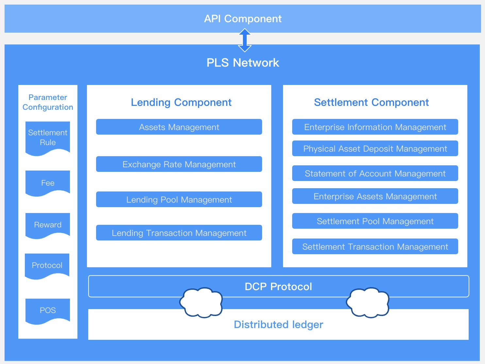

# Welcome To PLS Network

A network that integrates payment, lending and enterprise settlement.

## What Is PLS？

Currency, as a general equivalent, originated from the Sumerians before 5000 BC. Since then, the development of currency has experienced multiple nodes such as physical currency, metal currency, substitute currency, credit currency, electronic currency, and so on. Starting from Bitcoin, currency has been brought into the stage of digital currency. In the development process of digital currency, Bitcoin has not solved all the problems that digital currency needs to solve, such as low-cost and rapid value transfer, support for daily high-frequency and low-amount payment, support for financial settlement and so on.

Therefore, as a supplement to Bitcoin and perfecting the world of digital currency, PLS was born. PLS is a decentralized network of peer-to-peer micropayments, micro-lending and financial settlement. PLS first has the function of value storage. Each PLS represents a certain value, and the value will dynamically change according to the relationship between supply and demand. When the number of PLS users reaches a certain threshold, the PLS network will automatically open the function of the lending layer. PLS holders can deposit PLS to lend other types of digital assets or physical assets to enhance the liquidity of their own assets. In addition, PLS will connect with enterprises in different countries and help companies make financial settlements in accordance with the settlement rules of both parties. As a result, PLS has opened up the links between enterprises and enterprises, and between enterprises and individuals, forming an ecosystem of payment, lending and settlement.

If you want to know more detail about PLS,the [white paper](./resources/whitepaper.pdf) may help you.

## Technology Architecture

The PLS network is roughly divided into two layers of structure and parameter configuration components. The bottom layer is a distributed ledger. PLS will first select among distributed networks that have been running for more than 1000+ days and make it the bottom layer of PLS. The selection standard are mainly as follows

- Transaction confirmation speed
- Consensus mechanism
- Handling fee
- Stability
- Code quality and contributors of the main Github repository
- Upgrade mechanism and rules

On the distributed network, PLS developers will build DCP protocol, lending and settlement components. The components use DCP protocol to connect to different distributed networks to achieve the purpose of reading and storing information in different networks. At the same time, when the existing distributed network cannot support the business of the upper-level components, the PLS team will consider developing own bottom layer distributed network.

## Current Progress

In our white paper, you can see the entire PLS roadmap. We have currently completed 2020 Q3 plan and ready to launch Q4 

#### 2020 Q3

- Technical design and economic model design of PLS network
- Pre-market preparation for PLS project
- Recruit the first batch of angel investors
- Investigate and analyze existing mainstream distributed networks

`Current Status: Completed`

#### 2020 Q4

- Issue PLS and start to build a basic PLS payment network to support the use of PLS through a variety of application scenarios and open up multiple payment tools at the same time
- Development of lending components for PLS network
- Develop DCP protocol, developers can use this protocol to connect different distributed networks

`Current Status: In Progress`

## Media

- Telegram: [https://t.me/plsnetwork](https://t.me/plsnetwork)
- Twitter: @network_pls
- Websit: [https://plsnetwork.github.io/](https://plsnetwork.github.io/)
- Github: [https://github.com/plsnetwork](https://github.com/plsnetwork)

